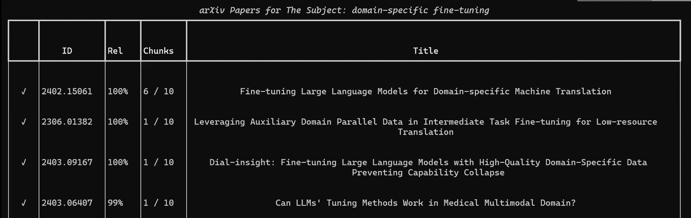

# RAG Research Assistant for the Fields of AI
> Data Analysis and Visualization Lab (094295) - Technion

## Introduction
Academic literature reviews and exploring new research direction are essential but time-consuming. Traditionally, this process was done using search engines like Google Scholar and required researchers to navigate a large volume of papers – a significant manual effort. The advent of large language models (LLMs) enabled easier navigation through large volumes of text, but still required researchers to find relevant documents first. These tools lack the features needed for focused and efficient research.

Our project focuses on creating a RAG-based research assistant that leverages the arXiv repository, a comprehensive source in fields like computer science, physics, and mathematics. While modern LLMs can access the web, they often require users to give specific instructions, such as explicitly prompting them to "search arXiv" and guiding them through each step of the research process. This approach can be cumbersome, and without precise input, general LLMs may still yield off-topic or outdated information. Our research assistant addresses these gaps by offering a dedicated tool that seamlessly integrates with arXiv, enabling users to define search objectives, choose to focus on relevant papers, and continue with new questions—without needing to guide the LLM at every step.

With a fully integrated retrieval and generation process, the assistant allows users to see which papers are used as the context before engaging in further exploration. This approach not only ensures precise, informative responses but also overcomes common LLM issues like outdated knowledge and hallucinations. By providing a controlled, targeted interface with arXiv, our tool offers researchers a streamlined, effective way to accelerate their studies and ideation processes.

## Our pipeline
The pipeline for our RAG-based research assistant begins with a user’s initial question, which is expanded into a detailed query to improve retrieval relevance. We call this ‘The Subject’ of research. This query is sent to a Pinecone VectorDB that stores the embedded abstracts of arXiv papers, allowing for efficient similarity-based retrieval. Based on this search, relevant papers are selected, and their full texts are fetched directly from arXiv. 

Once retrieved, the text is extracted from the PDFs and divided into paragraph-sized chunks to facilitate more targeted retrieval. These chunks are then reranked using Cohere's reranker, aligning them with the expanded query for optimal relevance. The top-ranked chunks are then combined and sent to Cohere’s Command R+ model, our generation engine, which generates a response based on the user’s question and the chat history.

With each question, the assistant updates its contextual understanding, preserving relevant information across interactions. Users can also provide feedback on the responses, which helps the model adapt to better match the user’s specific research needs and preferred response style over time. This feedback loop ensures that the assistant not only delivers more accurate information but also becomes increasingly personalized to the user’s style.

## Running the Code
What will you need?
- install the requirements using `pip install -r requirements.txt`
- Pinecone API key
- Cohere API key
- GCP Application Credentials file (for accessing the full paper though GCP)

Create .env file with the API keys, as appears in the [example file](example-env)

### Creating a Pinecone index
First, the index of the abstracts needs to be created. You can run [`index_creation.py`](index_creation.py) to fetch the most updated [arXiv dataset](https://www.kaggle.com/datasets/Cornell-University/arxiv) from Kaggle and index it into a Pinecone index.

### Starting the assistant
The assistant can be started by running `python assistant.py`

### Usage Guide
You the chatbot as you use ChatGPT.

The context retrieved will be printed in a table while the papers are processed.
The table will look like this:

Columns:
1. If the paper needs to be fetched and not cached already, the check-mark on the left will be a loader.
2. The arXiv ID of the paper, so you can search it more easily.
3. The relevance score of the paper (as a whole) in regard to the subject (that appears in the title of the table)
4. The number of chunks (out of the total number of chucked) from this paper that were eventually passed as the context for the generation of this response.
5. The title of the paper.

If you want to send feedback to the system, you can use the `/feedback <FEEDBACK>` command.

If you want to check what are the style instructions generated for the assistant, you can use the `/ins` command.